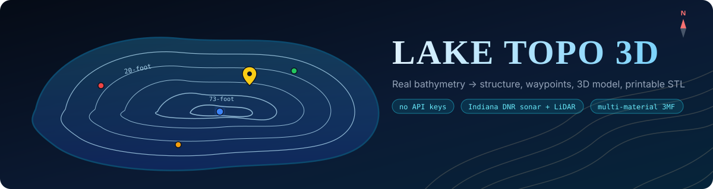
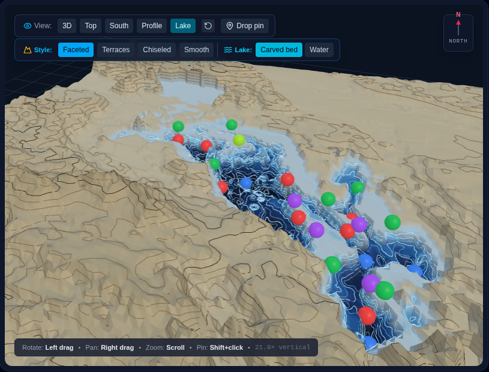
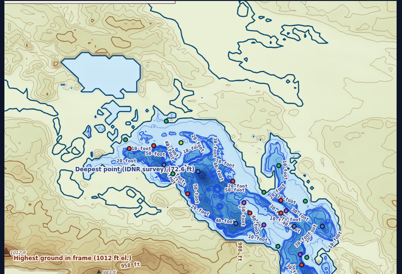
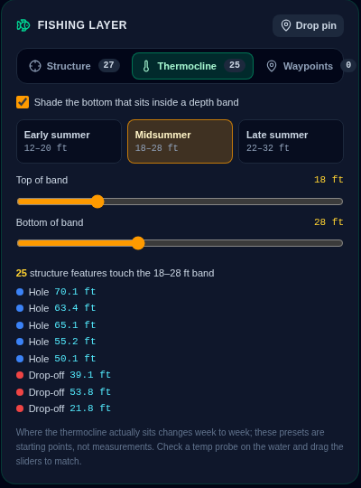
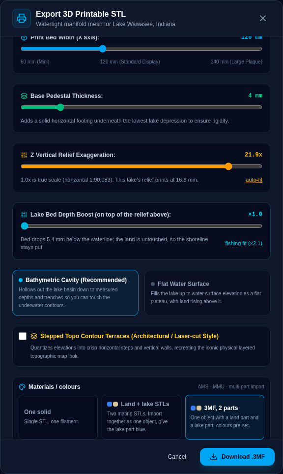

<p align="center">
  
</p>

<p align="center">
  
  
  
  
  
  
</p>

<p align="center">
  Type the name of a lake. Get its <b>real shoreline</b>, <b>real terrain</b>, the best <b>bathymetry on record</b> (or <b>your own soundings</b>), an interactive 3D model with <b>real sun shadows</b>, a vector survey map, a <b>fishing layer</b> (structure, thermocline band, waypoints, contour routes, cross-sections, windblown banks, GPX), a <b>watertight STL / 3MF</b> for the printer and a <b>laser-cut layer pack</b>.<br>
  <sub>No API keys for any of the map data. An LLM is optional and only fills gaps. Every number says where it came from.</sub>
</p>

---

## What it does

| | |
| --- | --- |
| 🗺️ **Real geometry** | OpenStreetMap shoreline, USGS 3DEP LiDAR ground (1 m across Indiana), Terrarium tiles anywhere else. |
| 📡 **Surveyed depths** | Indiana DNR sonar contours for 150+ lakes, drawn as the survey's own lines and interpolated into the grid. Elsewhere, a modelled bowl scaled to the max depth on record, labelled as such. |
| 🎣 **Structure finder** | Holes, humps, drop-offs, points, flats and saddles detected from the depth grid, ranked, mapped, and one click from becoming a waypoint. |
| 🌡️ **Thermocline band** | Shade every bit of bottom between two depths and see which structure sits in it. Seasonal presets, sliders for the real number off your probe. |
| 📍 **Waypoints + GPX** | Shift-click the model or the map. Exports GPX 1.1 that Humminbird, Lowrance, Garmin and Navionics import, with depth in the description. |
| 🧊 **3D that tells the truth** | True-scale vertical exaggeration, a separate **depth boost** for the bed, "fishing fit", draped DNR contour lines, lat/lon under the cursor. |
| 🖨️ **Printable** | Closed-manifold STL, north up, verified. **Land + lake as two mating solids** or one two-part 3MF for AMS / multi-material printers. |
| 📄 **Paper-style survey map** | SVG with hypsometric raster, contour labels the way the DNR sheets do them, spot heights, scale bar, DMS corners. |
| ⚓ **Your own soundings** | Upload CSV/TSV/GPX depth soundings from a sonar unit and the bed is rebuilt from them, shoreline held at zero, labelled honestly. |
| 🧭 **Routes and sections** | Every loop of a chosen depth contour as a GPX track to steer along; click two points for a bottom-profile chart with structure and the thermocline band. |
| ☀️ **Sun and wind** | Light the model from the real solar position for a date and time, shadows corrected for exaggeration so shade lines are true length; windblown banks highlighted. |
| 🪚 **Laser-cut layer pack** | Every contour level as closed cut lines in SVG or DXF, tiled with registration holes, with the stack height and exaggeration for your material. |

## Screenshots

| 3D model, fishing chart palette, structure markers | Survey map with native DNR contours |
| --- | --- |
|  |  |

| Fishing layer: thermocline band | Export: depth boost and multi-material |
| --- | --- |
|  |  |

## Quick start

```bash
bun install          # or npm install
cp .env.example .env # optional
npm run dev          # http://localhost:3000
```

`npm run check` runs the type check plus four self-tests: STL manifold, structure detection, laser layer pack, soundings interpolation. `npm run build && npm start` serves the production bundle.

## Where the data comes from

| Layer | Source | Coverage |
| --- | --- | --- |
| Shoreline | OpenStreetMap via Nominatim (`polygon_geojson`), islands and multipolygons honoured | worldwide |
| Elevation | USGS 3DEP image service, float32 GeoTIFF resampled to the grid. 1 m where states have flown LiDAR (all of Indiana) | United States |
| Elevation fallback | Terrarium terrain tiles (AWS Open Data / Mapzen) | worldwide |
| Bathymetry | **Indiana DNR Fish & Wildlife sonar contours** (IndianaMap feature service, 150+ lakes), interpolated between contour lines | Indiana |
| Bathymetry fallback | Distance-to-shore bowl scaled to the max depth on record | everywhere else |
| Bathymetry, yours | Depth soundings you upload (CSV/TSV/GPX), inverse-distance interpolated inside the shoreline; wins over every other source | anywhere |
| Depth / facts | Curated table → Wikipedia infobox / Wikidata → optional LLM → estimate from area | worldwide |
| Depth-map PDFs | Indiana DNR "Lake Depth Maps" index, linked when the lake has one | Indiana |

Every result says which of these it used (`geometrySource`, `demSource`, `bathymetrySource`, `generationMethod`, `depthIsEstimated`) in the UI, the JSON and the SVG map footer. Lookups are cached on disk under `.cache/`.

Offline (`GEODATA_DISABLED=true` or `?offline=true`) falls back to a hand-built Deam Lake model or a procedural placeholder, labelled as such.

## Optional LLM

Set `LLM_PROVIDER` (or just an API key) to enable AI recon and chart-image reading. Supported: Anthropic (official SDK), OpenAI, OpenRouter, Venice, Ollama, LM Studio, any OpenAI-compatible endpoint (`custom` + `LLM_BASE_URL`), Gemini. The model only receives the sourced facts and is asked to fill what's missing; its answers are labelled "LLM from memory (unverified)" unless the provider returned web citations (Anthropic web search, Gemini grounding). Sourced numbers are never overwritten by the model.

## Fishing layer

Everything below is computed from the depth grid in the browser (`src/lib/structure.ts`), so it is only as good as the bathymetry underneath: on an Indiana DNR-surveyed lake it is real structure, on a modelled bowl it is mostly the bowl.

- **Structure**: holes (local depth maxima with prominence), humps (isolated tops surrounded by deeper water), drop-offs (connected steep bottom, with depth range and average slope), points (land running into the lake, with the depth it runs out to), flats (broad 3–15 ft shelves), saddles (shallowest crossing between two holes). Markers on the 3D model and the 2D map; click one in the list to fly to it.
- **Thermocline band**: shade every bit of bottom between two depths, with presets for early / mid / late summer. The panel lists which structure touches the band. The presets are starting points, not measurements.
- **Cursor readout**: depth or elevation plus lat/lon under the pointer, in both views.
- **Waypoints**: shift-click (or "Drop pin" then click) on the model or the map. Stored in the browser per lake. Any structure feature can be saved as a waypoint. Export **GPX 1.1** (waypoints, or waypoints + structure) for Humminbird, Lowrance, Garmin and Navionics; depth goes in the description.
- **Native DNR lines**: on surveyed lakes the DNR contour vectors themselves are draped on the 3D bed and drawn on the 2D map with their "24-foot" style labels, instead of re-contoured grid lines. Land spot heights come from the DEM.
- **Fishing chart palette**: 5 ft depth bands.
- **Routes**: pick a depth and every loop of that contour is listed with its length; check the ones you want, they light up amber on the model and the map, and export as **GPX tracks** to steer along on a Humminbird, Lowrance or Garmin. Uses the DNR vectors when the survey has that depth.
- **Cross-section**: "Section" then click two points on the model or the map. A profile chart shows the bottom and banks between them with the thermocline band and any structure near the line. PNG export.
- **Sun & wind**: light the model from the sun's real position for a date and time (NOAA solar position); shadows are cast with the elevation angle corrected for the vertical exaggeration so shade lines on the ground are true length. A wind direction highlights the banks that face it in orange and draws the arrow above the model.
- **Bring your own bathymetry**: upload depth soundings (CSV/TSV with latitude, longitude, depth columns, or GPX points with a depth) and the lake bed is rebuilt from them, shoreline held at zero. The result is labelled "Your soundings" everywhere and never mixed with the modelled bowl.

## STL / 3MF

Heightfield + flat base + walls, verified closed manifold (`npm run verify`). +X east, +Y north, +Z up. Vertical exaggeration is a multiple of true scale (1.0x = same mm/m as the horizontal axes); "auto-fit" picks a printable relief. Midwestern lakes are nearly flat at 1x, so 3x–8x is typical.

**Depth boost** exaggerates the lake bed on top of that without touching the land. Both are anchored at the water surface, so the shoreline stays continuous. A reservoir in the hills (Deam Lake: ~40 ft of depth inside ~200 ft of surrounding relief) prints its bed as a sliver at one global scale; "fishing fit" picks the boost that makes the bed as tall as the land is high. The viewer and the STL/3MF use the same numbers. Pair it with the **Lake only** frame for a print that is mostly bathymetry.

**Multi-material**: "Land + lake STLs" writes two mating solids in the same frame (every grid cell inside the shoreline, cut vertically from the bed to the base, is the lake part). Import both into Bambu Studio / PrusaSlicer as one object with multiple parts and give the lake part its own filament. "3MF, 2 parts" writes one object with a land component and a lake component, each with a base-material colour hint. The verify script checks that both parts are closed and that their volumes sum to the single solid's.

**Laser-cut layer pack**: from the same export dialog, every contour level (2, 5 or 10 ft steps) becomes a sheet of closed cut lines tiled on one page as **SVG** or **DXF R12** in millimetres. Water sheets are the full rectangle with the deeper lake cut out, land sheets are the hills as positive pieces, and every sheet carries registration holes and an engraved label. The dialog shows how tall the stack will be for your material thickness and how exaggerated that is versus true scale. `npm run verify` checks that every ring closes and that sheet areas shrink monotonically up the stack.

## Environment

See `.env.example`. Highlights: `PORT`, `LLM_PROVIDER` / `LLM_MODEL` / `LLM_BASE_URL`, `DEM_SOURCE` (`auto|3dep|terrarium`), `IDNR_DISABLED`, `WIKI_DISABLED`, `GEODATA_DISABLED`, `GEODATA_USER_AGENT` (Nominatim asks for a contact), `LAKE_CACHE_DIR`.

## API reference

| Route | Method | Description |
| --- | --- | --- |
| `/api/health` | GET | Status, LLM provider/model in use, geodata enabled |
| `/api/lakes` | GET | Curated lake registry (metadata only) |
| `/api/lookup?q=` | GET | Shoreline lookup only: name, centroid, area, OSM id |
| `/api/lake-terrain?q=&gridSize=&forceAiRecon=&userNotes=&offline=&framePad=` | GET | Full terrain grid + SVG map (`framePad` = padding around the lake as a fraction of its longer side, default 0.28; 0.06 gives a lake-only frame) |
| `/api/lake-terrain` | POST | Same as GET; JSON body may include `uploadedImage {base64, mimeType}` and `soundings [{lat, lon, depthM}]` (up to 50,000 of your own depth soundings, which replace every other bathymetry source when 3+ fall inside the shoreline) |
| `/api/analyze-topo-image` | POST | Vision read of an uploaded chart (`imageBase64`, `mimeType`, `query`, `gridSize`); needs an LLM |
| `/api/ai-topo-recon` | POST | LLM recon (`query`, `userNotes`, `gridSize`); needs an LLM |
| `/api/cache/clear` | POST | Drop the in-memory terrain cache |

Terrain response: `metadata` (name, location, depths, sources, `topoFeatures`, the source labels above, `dnrPdfUrl`, `wikipediaUrl`, `surveyDate`, `soundingCount` when built from your soundings), `gridSize`, `elevations[row][col]` (m MSL, row 0 = north), `waterMask`, `depths` (m), `physicalWidthKm/HeightKm`, `svgTopoMap`, `surveyContours` (native survey polylines in fractional grid coordinates, surveyed lakes only), `spotElevations` (land spot heights).

## Attribution

Shoreline data © [OpenStreetMap contributors](https://www.openstreetmap.org/copyright), ODbL. Elevation from [USGS 3DEP](https://www.usgs.gov/3d-elevation-program) and the [Terrain Tiles](https://registry.opendata.aws/terrain-tiles/) dataset (Mapzen / Tilezen). Bathymetry and depth maps © Indiana Department of Natural Resources, Division of Fish & Wildlife, reproduced with credit as their terms require. Lake facts from Wikipedia (CC BY-SA) and Wikidata (CC0).
